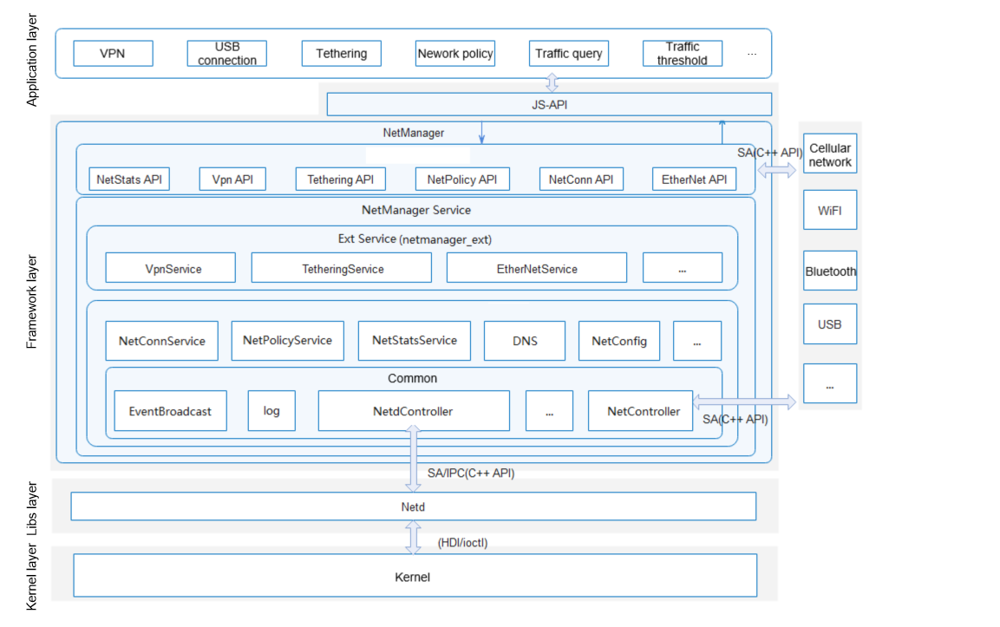

# NetManager

## Introduction

The NetManager module is a tailorable component of the Telephony subsystem. Key components of the module include NetConnService (connection management), NetPolicyService (policy management), NetStatsService (traffic management), TetheringService (network sharing), VpnService (VPN management), and EtherNetService (Ethernet connection).

**Figure 1**  NetManager architecture



## Directory Structure

```
foundation/communication/netmanager_base/
├─figures                     // Architecture
├─frameworks                  // Framework layer
│  ├─js                       // JavaScript APIs
│  └─native                   // Native APIs
├─interfaces                  // API definitions
│  ├─innerkits                // JavaScript APIs
│  └─kits                     // Native APIs
├─sa_profile                  // SA profile
├─services                    // IPC server-side implementation
├─test                        // Test code
└─utils                       // Utilities
```

## Available APIs

| Type| API| Description|
| ---- | ---- | ---- |
| ohos.net.connection | function getDefaultNet(callback: AsyncCallback\<NetHandle>): void; |Creates a **NetHandle** object that contains the **netId** of the default network. This function uses an asynchronous callback to return the result.|
| ohos.net.connection | function getDefaultNet(): Promise\<NetHandle>; |Creates a **NetHandle** object that contains the **netId** of the default network. This function uses a promise to return the result.|
| ohos.net.connection | function getConnectionProperties(netHandle: NetHandle, callback: AsyncCallback\<ConnectionProperties>): void; |Queries link information of the default network. This function uses an asynchronous callback to return the result.|
| ohos.net.connection | function getConnectionProperties(netHandle: NetHandle): Promise\<ConnectionProperties>; |Queries link information of the default network. This function uses a promise to return the result.|
| ohos.net.connection | function getNetCapabilities(netHandle: NetHandle, callback: AsyncCallback\<NetCapabilities>): void; |Queries the capability set of the default network. This function uses an asynchronous callback to return the result.|
| ohos.net.connection | function getNetCapabilities(netHandle: NetHandle): Promise\<NetCapabilities>; |Queries the capability set of the default network. This function uses a promise to return the result.|
| ohos.net.connection | function hasDefaultNet(callback: AsyncCallback\<boolean>): void; |Checks whether the default network is available. This function uses an asynchronous callback to return the result.|
| ohos.net.connection | function hasDefaultNet(): Promise\<boolean>; |Checks whether the default network is available. This function uses a promise to return the result.|
| ohos.net.connection | function getAddressesByName(host: string, callback: AsyncCallback\<Array\<NetAddress>>): void; |Obtains all IP addresses of the default network by resolving the domain name. This function uses an asynchronous callback to return the result.|
| ohos.net.connection | function createNetConnection(netSpecifier?: NetSpecifier, timeout?: number): NetConnection; |Creates a **NetConnection** object. **netSpecifier** specifies the network, and **timeout** specifies the timeout interval. **timeout** is configurable only when **netSpecifier** is specified. If neither of them is present, the default network is used.|
| ohos.net.connection | function getAddressesByName(host: string): Promise\<Array\<NetAddress>>; |Obtains all IP addresses of the default network by resolving the domain name. This function uses a promise to return the result.|
| ohos.net.connection.NetHandle | getAddressesByName(host: string, callback: AsyncCallback\<Array\<NetAddress>>): void; |Obtains all IP addresses of the specified network by resolving the domain name. This function uses an asynchronous callback to return the result.|
| ohos.net.connection.NetHandle | getAddressesByName(host: string): Promise\<Array\<NetAddress>>; |Obtains all IP addresses of the specified network by resolving the domain name. This function uses a promise to return the result.|
| ohos.net.connection.NetHandle | getAddressByName(host: string, callback: AsyncCallback\<NetAddress>): void; |Obtains an IP address of the specified network by resolving the domain name. This function uses an asynchronous callback to return the result.|
| ohos.net.connection.NetHandle | getAddressByName(host: string): Promise\<NetAddress>; |Obtains an IP address of the specified network by resolving the domain name. This function uses a promise to return the result.|
| ohos.net.connection.NetConnection | on(type: 'netAvailable', callback: Callback\<NetHandle>): void; |Listens to **netAvailable** events.|
| ohos.net.connection.NetConnection | on(type: 'netCapabilitiesChange', callback: Callback\<{ netHandle: NetHandle, netCap: NetCapabilities }>): void; |Listens to **netCapabilitiesChange** events.|
| ohos.net.connection.NetConnection | on(type: 'netConnectionPropertiesChange', callback: Callback\<{ netHandle: NetHandle, connectionProperties: ConnectionProperties }>): void; |Listens to **netConnectionPropertiesChange** events.|
| ohos.net.connection.NetConnection | on(type: 'netLost', callback: Callback\<NetHandle>): void; |Listens to **netLost** events.|
| ohos.net.connection.NetConnection | on(type: 'netUnavailable', callback: Callback\<void>): void; |Listens to **netUnavailable** events.|
| ohos.net.connection.NetConnection | register(callback: AsyncCallback\<void>): void; |Registers an observer for the default network or the network specified in **createNetConnection**.|
| ohos.net.connection.NetConnection | unregister(callback: AsyncCallback\<void>): void; |Unregisters the observer for the default network or the network specified in **createNetConnection**.|

## Usage

### Obtaining IP Addresses of the Default Network by Resolving the Domain Name (Promise Mode)

* Example
  ```javascript
  import net_connection from "@ohos.net.connection" 
  ```
  ```javascript
  net_connection.getAddressesByName("www.example.com").then(function (addresses) {
    console.log(JSON.stringify(addresses))
  })
  ```

### Registering an Observer for the Default Network

* Example
  ```javascript
  import net_connection from "@ohos.net.connection" 
  ```
  ```javascript
  let netConnection = net_connection.createNetConnection()
  netConnection.on('netAvailable', function(data) {
    console.log(JSON.stringify(data))
  })
  netConnection.register(function (error) {
    if (error) {
      console.log(JSON.stringify(error))
    }
  })
  ```

## Repositories Involved

Network Management Subsystem

**communication_netmanager_base**

[communication_netmanager_ext](https://gitee.com/openharmony/communication_netmanager_ext)

[communication_netstack](https://gitee.com/openharmony/communication_netstack)
